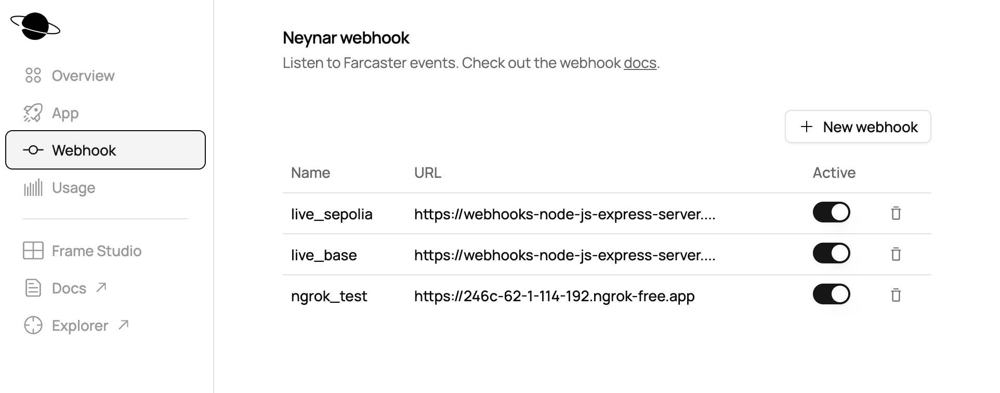
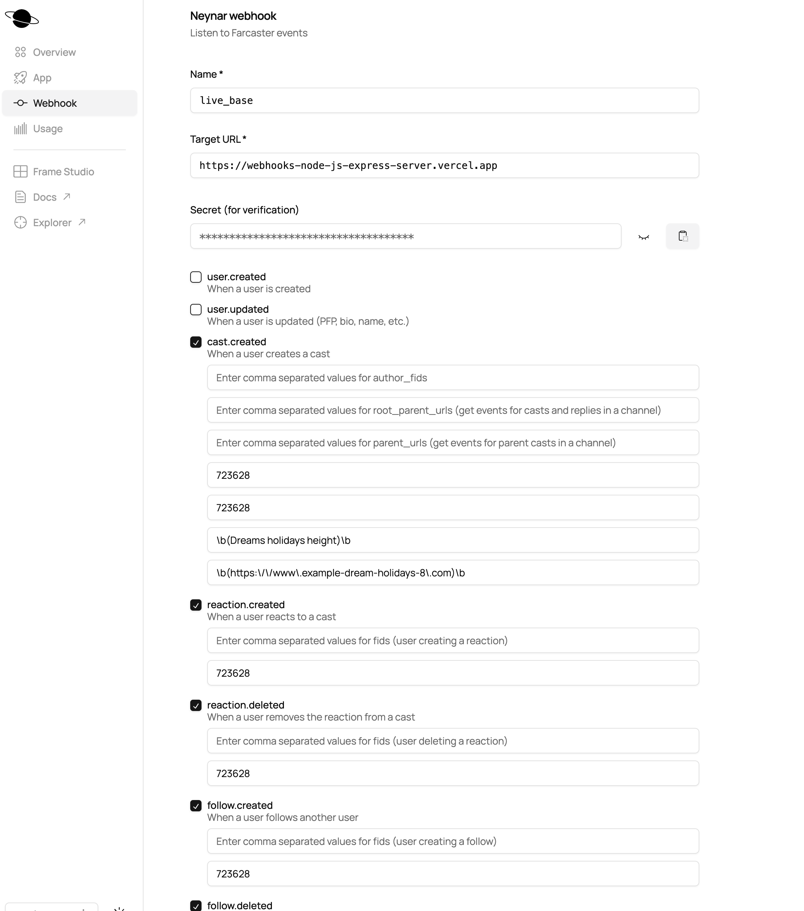

## Spark Repos

1. Front End : https://github.com/Entity54/OCS-SPARK-FE
2. Webhooks Server: https://github.com/Entity54/OCS-Webhooks-Server
3. Keepers Server: https://github.com/Entity54/OCS-Keepers-Server
4. Website: https://spark-two-ecru.vercel.app/

## Installation

```
$npm install
```

Also see at the bottom of the page for more instructions about HardHat

## Deployment

In scripts we have written a deployment script of each of the four smart contracts we have written

The easiest way for deployement and initiation is to run the below from the route folder

```
npx hardhat run  scripts/deploy_all_and_inititate.js --network base
npx hardhat run  scripts/deploy_all_and_inititate.js --network base-sepolia
```

Deploys all smart contracts

In addition in our smart contracts besides the deployer account being automatically the admin we have

```
   function toggleAdministrator(address newAdministrator) external onlyAdmin {
        require(
            admin != newAdministrator,
            "action only for toggling external administrators"
        );
        isAdministrator[newAdministrator] = !isAdministrator[newAdministrator];
    }
```

where the admin can allow certain accounts (e.g. Webhooks server allocated Ethereum accounts, Keepers server) and sibling smart contract to get access to write on a specific smart contract e.g. SquawkProcessor calls via "processSquawkData" the InfuencersManager.sol to award or deduct points to an Infuencer based on his action as received in the Squawk Box from the Webhooks server.

> Note: Toggling permission to smart contracts and accounts as described above is a common reason for transaction rejections, as for safety certain functions that change the state can only be called by white-listed Admin accounts

After the above the smart contracts are ready to be used.

A DeploymentData.json in scripts/deployments is updated and contains the addresses that each smart contract is deployed on Base and Base Sepolia. This file is also present identical in all our repos

<br>

---

## Smart Contracts

Our protocol has four smart contracts

### CampaignManager

Responsible for managing the lifeline of a campaign from registration and Pending to Active, calculating distributions, making payments and completing the campaign

### InfluencersManager

Responsible for managing the Infuencer side from registration of an Infuencer on the Protocol for the first time, Registering the Infuencer on a specific Campaign to storing the Infuencer details e.g. Fid and Verified Ethereum account

### CampaignAssets

Responsible for storing Campaign Emebed Urls (Website or Frame url), taglines and all relevant Webhook data that wll be used for filtration of incoming messages from the Webhook server

### SquawkProcessor

This is the point of contact of our Webhooks server.
Our Webhooks server is notified from Neynar when a specific farcaster action is performed. The Webhooks server analyses the action and calls the SquawkProcessor to register this in the Squawk Box.

The Keepers server is responsible to call "processSquawkData" to process existing unprocessed actions and award points to the relevant infuencers.

This Squawk Box registry is shown in the Squawk page of the website

---

Keepers Server side

1. **checkPendingCampainStatus** to move a campaign from Pending to Active when it reaches startTime
2. **checkActiveCampainStatus** to move a campaign from Active to Expired when it reachea end time
3. **calculateDistributions** for each Expired Campaign to calculate weights of each infuencer based on his/her points so that we know how much funds they are eligible to receive
4. **checkExpiredCampainStatus** for Expired Campaigns when the previous step calculateDistributions is complete , move them to readyFroPaymentCampaignUIDs campaigns
5. **makePayments** for campaigns that are in readyFroPaymentCampaignUIDs
6. **checkReadyForPaymentStatus** to move campaign from Ready2Payment to Completed
   > When a campaign has paid funds then it will be of state Paid otherwise (if no points were scored) Void and the campaign owner can get his ETH back.

---

## Future Plans and Thoughts

1. **Chainlink Automations**: We plan to use Chainlink Automations to eliminate the need for Keeper Servers. Currently, Chainlink Automations are only available on Base, not on Base-Sepolia.
2. **Creator's Marketplace Expansion**:

   - **Current Use**: Spark currently manages marketing campaigns on Farcaster through registered influencers. Campaign owners are responsible for preparing or purchasing all marketing assets (casts, frame cast intents, taglines, etc.).
   - **Future Vision**: In the distributed ledger technology space, access to global talent is a significant advantage. We aim to create a marketplace where various talents—such as graphic designers and marketing experts—can register on Spark and offer their skills for specific campaigns.
     - **Functionality**: This marketplace would allow talents to work individually or collaboratively to create marketing assets. Campaign owners could then select and utilize these third-party assets, benefiting from diverse skills and creativity.
     - **Budget Allocation**: Campaign owners could allocate their budget into two parts: budget A for influencers (following the current process) and budget B for creators. When a creator's marketing asset is used, they earn points based on the campaign owner's scoring system (e.g., 1 point for a like, 7 points for a re-cast), multiplied by the number of followers of the user interacting with the asset.
     - **Reward Distribution**: Similar to the current influencer reward system, budget B would be distributed proportionally to creators based on the points they accumulate.

3. **Cast Scheduler**:

   - By leveraging Chainlink Automations and Functions, and recording the campaign owner's signer via the "Sign with Neynar" button, we could develop a scheduler to stream a series of casts at preconfigured timestamps. This would maximize exposure to targeted market segments.

4. **Advanced Analytics**:
   - The use of points for Farcaster actions can be extended to create detailed analytics. This would help identify the best times to cast, evaluate the results of A/B testing for frames and impressions, and optimize overall campaign performance.

## Hurdles Encountered

To be honest, despite being an experienced developer in the crypto space, the first half of the month was consumed with studying the available material and attending organized regular office hours and workshops.

Any errors, bugs, gaps in documentation, or my own mistakes were promptly and efficiently addressed by the Base, Neynar, Farcaster, and Frog teams. I am truly grateful for their timely responses and clarifications.

## What was most impressive

1. Organisation of hackathon (Regular Office hours - Workshops - Discord and Telegram prompt support)
2. The concept of Smart Wallet and how different it is to most existing non-custodian wallets that demand certain understanding of Crypto jargon and tech that imposes signifcant barriers to users and delaying product-market-fit
3. The advancements of Farcaster and the endless abilities in using and monitoring Frames

---

Accounts used:

1. Deployer / Keepers1 Server : 0xa9c43e4eadFBa326E6C0606B1cd2083a1d2f3a10
2. Webhooks Server : 0x2aaB2CF85d60deBe140e7162f9B8CdBcbdbA9067
3. Keepers2 Server : 0x2e66BD0DBa90a5fAbe06A637B55b067FCF34EE86

---

1. Webhooks Server : https://webhooks-node-js-express-server.vercel.app
2. Keepers Server Base : https://keepers-node-js-express-server-base.vercel.app
3. Keepers Server Base-Sepolia : https://keepers-node-js-express-server-base-sepolia.vercel.app

---

### Neynar Webhooks

Targets



Subscriptions as submitted during New Campaign Creation at the Spark Website



---

## Basic Flow Description

1. Campaign Owner creates a New Campaign defining the specs of the campaign and transferring to CampaignManager.sol the Budget in ETH
2. While Registering the new campaign a tx is also submitted to CampaignAssets.sol to keep hold of the Webhook data and Marketing assets (Tagline , Emded url) of the campaign
3. A Neynar Rest Api call is made to ammend accordingly the data (this is the data registered in 2. above) in the Neynar Webhooks to track
4. Influencers if new to the Spark protocol register (needed only once) and also register to the campaign.
5. Keepers server monitors the route of a campaign from Pending, to Active, to Expired, to Calculating Distributions, to Ready for payment, to make the payments, to record this as completed.
6. Once the campaign is active, Infuencers perform actions on Farcaster. If these actions are eligible according to the pre-defined campaign rules, are picked up by the Webhooks server which in turn records to the SquawkProcessor.sol by calling "addSquawkData"
7. Keepers server calls SquawkProcessor.sol processSquawkData to process and reward with points the Influencers for their performed Farcaster actions
8. Once the campaign is Expired it is followed up by Keepers server calling "calculateDistributions" on CampaignManager.sol followed by "makePayments" and "checkReadyForPaymentStatus" to pay the Spark protocol fees and all the relevant Influencers and converting the campaign to Paid and complete.

---

# Hardhat instructions

### Installation

1. Create new folder and npm init
2. `npm install --save-dev hardhat`
3. `npx hardhat init` Choose Javascript project

<br>

This project demonstrates a basic Hardhat use case. It comes with a sample contract, a test for that contract, and a Hardhat Ignition module that deploys that contract.

Try running some of the following tasks:

```shell
npx hardhat help
npx hardhat test
REPORT_GAS=true npx hardhat test
npx hardhat node
npx hardhat ignition deploy ./ignition/modules/Lock.js
```

```
 $npx hardhat compile
```
